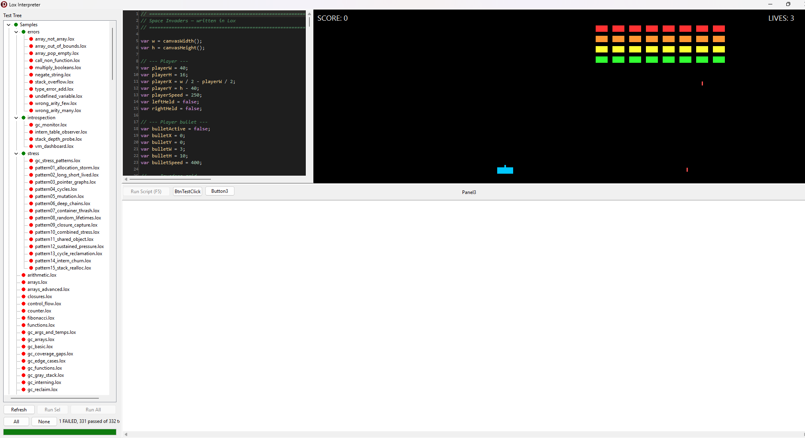

# Suto — A Lox Dialect in Delphi Pascal

**Suto** is a bytecode-interpreted, garbage-collected, NaN-boxed dialect of Bob Nystrom's [Lox](https://craftinginterpreters.com/) language, implemented in Delphi Pascal — extended with a 2D game engine, event-driven callbacks, file I/O, SQL database access, records, and peephole optimizations. The syntax is Lox; the runtime, extensions, and native surface are ours.

The VM follows Bob's [Crafting Interpreters](https://craftinginterpreters.com/) (Chapters 14–26) and then keeps going.

## Why "Suto"?

*Suto* (Tongan) — to hitch a ride; a freeloader; someone who tags along without contributing. Used affectionately among friends: *"Oi, suto!"*

This project is a **suto** on Bob's work. Every core concept in the VM — the scanner, the Pratt parser, the bytecode chunk, the stack machine, the closure representation, the mark-sweep GC, the hash table — came from *Crafting Interpreters*. We took the ride. The extensions on top (records, arrays, dictionaries, NaN boxing, game engine, RTTI injection, event dispatcher, SQL) are ours, but the frame they hang on is Bob's.

The name is chosen with the same tone the word carries in Tongan: half acknowledgement, half self-mockery, and above all a nod of respect to whoever's doing the driving. Nystrom's book is one of the most generous gifts to hobby language design in the last decade. Naming the language *Suto* is us tipping our cap.



## Features

### Language & VM

- **Scanner & Compiler** — Single-pass Pratt parser compiling to bytecode
- **Virtual Machine** — Stack-based VM with call frames, closures, and upvalues
- **NaN Boxing** — `TValue = UInt64`; doubles stored as raw IEEE-754 bits, non-number values encoded as quiet NaN payloads. Canonicalizes NaN inputs via `CANON_NAN` to prevent tag-space collisions. ~2.6× faster than tagged-union on fib(40).
- **Garbage Collection** — Mark-sweep GC with tricolor marking and gray stack worklist
- **String Interning** — Hash table with weak references for automatic deduplication
- **Dynamic Stack** — Growable value stack (starts at 256 slots, grows to 65 536) with automatic frame/upvalue pointer rebasing after realloc
- **Arrays** — Dynamic arrays with literal syntax (`[1, 2, 3]`), subscript get/set (`arr[i]`), plus native functions (`newArray`, `arrayPush`, `arrayPop`, `arrayGet`, `arraySet`, `arrayLen`, `arrayRemove`)
- **Dictionaries** — Hash-table dictionaries with generalized keys (any hashable TValue), Swift-style literal syntax (`[:]`, `["key": val]`), subscript get/set, PascalCase method API (Set, Get, Has, Delete, Keys, Values, Size), linear probing with tombstones, 75% load factor, bounded probing, GC-integrated
- **Records** — Immutable-structure value types via `record Name(field1, field2);` syntax with dot access and field mutation
- **Native Objects** — Inject Delphi classes as GC-tracked Lox objects with automatic RTTI-based property and method dispatch
- **RTTI Injection** — Any Delphi `TObject` descendant can be injected into a Lox script via `InjectObject()`; published properties and methods are automatically accessible without wrapper code. Supports nested objects, object-typed method arguments, sets, dynamic arrays, property mutation, method invocation with marshaling between Lox and Delphi types. Denylist prevents scripts from calling `Free`/`Destroy` and other lifecycle methods.
- **Anonymous Functions** — First-class lambda expressions: `fun(params) { body }` usable anywhere an expression is valid — assigned to variables, passed as arguments, returned from functions, or immediately invoked
- **Callbacks** — `InvokeCallback` re-entrant VM dispatch allowing Delphi natives to call Lox closures; `callWith(fn, arg)` and `invoke(fn, ...)` variadic natives for host-to-script function invocation

### Performance Optimizations

- **NaN Boxing** — Eliminates heap-allocated tagged unions; all values fit in a single 8-byte register
- **Peephole Optimizations** — Fused opcodes: `OP_JUMP_IF_FALSE_POP` (fused test+pop), `OP_LESS_JUMP_IF_FALSE` (fused comparison+branch for `for` loops), `OP_POP_N` (bulk pop)
- **Fast Local Slots** — `OP_GET_LOCAL_0..7` / `OP_SET_LOCAL_0..7` encode slot index in the opcode itself, saving 1 bytecode byte and 1 dispatch per access
- **Inline Fast Paths** — `pushStack` / `popStack` / `peekStack` are `inline` with cold-path delegation for stack growth
- **NaN Canonicalization** — `CreateNumber` uses `Move()` (not pointer punning) for aliasing-safe bit conversion; NaN payloads that collide with tag space are canonicalized to `CANON_NAN`

### 2D Game Engine

- **Software-rendered canvas** — 320×240 logical resolution (configurable), auto-scaled with letterboxing, double-buffered
- **Sprites** — Create from pixel arrays, PNG files, PNG regions, or palette indices; draw, scale, rotate, flip; automatic sprite sheet slicing
- **Tilemaps** — Create tile grids from sprite sheets; set/get individual tiles; draw with camera offset
- **Surfaces** — Off-screen render targets for compositing
- **Camera** — Global camera offset for scrolling
- **Input** — `keyHeld()`, `keyPressed()`, `mouseX/Y()`, `mouseDown()`, `mouseClicked()` — edge-triggered per frame
- **Sound** — 4-channel waveform synthesizer: `playNote(freq, duration, waveform, channel)`, `playSequence()` for melodies, `stopSound()`, `stopAllSound()`
- **Game Loop** — `processMessages()` pumps the Windows message queue mid-script; scripts run as cooperative game loops with event polling
- **Event Engine** — Decoupled `TLoxEventEngine` with callback-driven input: `onKeyPressed`, `onKeyReleased`, `onKeyHeld`, `onMouseDown`, `onMouseUp` callbacks invoked per-frame via `processEvents()`; held-key tracking with snapshot-based dispatch to prevent re-entrancy crashes

### File I/O & Process Execution

- **File Operations** — `fileExists(path)`, `directoryExists(path)`, `readFile(path)`, `writeFile(path, content)`, `writeCsv(path, rows)` (RFC 4180 compliant)
- **Process Execution** — `exec(cmd)` returns stdout as string; `execResult(cmd)` returns dictionary with `output`, `exitCode`, `success` fields — non-zero exit is not a runtime error

### Database Access

- **SQL Server** — `sqlConnect(config)`, `sqlQuery(conn, sql)`, `sqlQueryParams(conn, sql, params)`, `sqlClose(conn)` — parameterized queries returning arrays of dictionaries, with connection pooling via FireDAC
- **Environment Variables** — `env(name)`, `loadEnv()` for `.env` file loading (connection strings, secrets)

### IDE & Tooling

- **Syntax-Highlighted Editor** — SynEdit-based Script Pad with custom Lox highlighter (keywords, built-ins, strings, numbers, comments), dark theme, line numbers, auto-indent, group undo
- **Event Queue** — `TLoxQueue` native object enables Delphi-to-Lox event passing; Delphi code enqueues string events from form handlers, Lox scripts poll via `events.hasItems()` / `events.dequeue()`
- **Interactive Script Execution** — `processMessages()` enables interactive scripts; automatic print output flushing; script abort on form close
- **Script Runtime Safety** — Run button, test buttons, and editor are disabled while a script is running
- **Modular Native Registry** — Each native domain lives in its own unit (`Natives/*.pas`); `NativeRegistry.RegisterAllNatives` auto-discovers and registers all modules at startup
- **VM Introspection** — `vmStackDepth()`, `vmStackCapacity()`, `vmCallDepth()`, `vmOpenUpvalues()`, `gcNextThreshold()`, `gcCollectionCount()`, `internTableStats()`, `loxClasses()`, `loxClassInfo()`, `loxObjects()`, `loxObjectInfo()`
- **Long-Operand Opcodes** — 24-bit constant indices for globals, closures, literals, and dot access (16M constant limit)

## Chapters Implemented

| Chapter | Topic |
|---------|-------|
| 14–15 | Chunks, constants, bytecode encoding (incl. OP_CONSTANT_LONG) |
| 16 | Scanner |
| 17 | Pratt parser and compiler |
| 18 | Value types (numbers, booleans, nil) |
| 19 | Strings with flexible array member allocation |
| 20 | Hash tables with linear probing and tombstones |
| 21 | Global variables |
| 22 | Local variables and block scoping |
| 23 | Control flow (if/else, and/or, while, for) |
| 24 | Functions, call frames, native functions |
| 25 | Closures and upvalues |
| 26 | Garbage collection (mark-sweep) |

### Extensions Beyond the Book

| Feature | Description |
|---------|-------------|
| NaN Boxing | `TValue = UInt64`, IEEE-754 bit encoding, NaN canonicalization, defensive `CreateObject` |
| Peephole Optimizations | Fused opcodes (`OP_JUMP_IF_FALSE_POP`, `OP_LESS_JUMP_IF_FALSE`, `OP_POP_N`), fast local slots (0–7) |
| Anonymous Functions | `fun(params) { body }` as expression — first-class lambdas, closures, IIFEs |
| Callbacks | Re-entrant `InvokeCallback` dispatch, `callWith`/`invoke` natives for host→script calls |
| Arrays | Literal syntax, subscript operators, native API, GC-integrated |
| Dictionaries | Literal syntax, subscript, method dispatch, tombstones, rehashing, GC-integrated |
| Records | `record Name(fields);`, dot access, field mutation, GC-integrated |
| Native Objects | Delphi class wrapping, `StringList()`, `OP_INVOKE`, GC-integrated |
| RTTI Injection | `InjectObject()`, auto-registration, property/method dispatch, nested objects, denylist |
| 2D Game Engine | Canvas, sprites, tilemaps, surfaces, camera, input, sound — full retro game development |
| Event Engine | `TLoxEventEngine` with callback-driven input, held-key tracking, snapshot dispatch |
| File I/O | `readFile`, `writeFile`, `writeCsv` (RFC 4180), `fileExists`, `directoryExists` |
| Process Execution | `exec`, `execResult` — run child processes with captured stdout/exitCode |
| SQL Database | FireDAC-based SQL Server access with parameterized queries |
| Environment | `.env` file loading, `env()` variable access |
| Native Registry | Modular `NativeRegistry` pattern — each domain in its own unit, auto-registered |
| VM Introspection | Runtime inspection of stack, GC, intern table, and native class registry |
| Modulo Operator | `%` for integers and floats |
| Conversion Functions | `str`, `num`, `bool`, `type` |
| String Library | `strlen`, `substr`, `indexOf`, `charAt`, `upper`, `lower`, `trim`, `split` |
| Math Library | `abs`, `floor`, `ceil`, `round`, `min`, `max`, `sqrt`, `pow`, `sin`, `cos`, `random` |
| Long-Operand Opcodes | `OP_*_LONG` for >255 constants per chunk |

## Native Functions (110+)

| Category | Functions |
|----------|-----------|
| Core | `clock`, `collectGarbage`, `assert`, `bytesAllocated`, `objectsAllocated` |
| VM Introspection | `vmStackDepth`, `vmStackCapacity`, `vmCallDepth`, `vmOpenUpvalues`, `vmFramesMax`, `vmStackMax`, `gcNextThreshold`, `gcCollectionCount`, `internTableStats`, `loxClasses`, `loxClassInfo`, `loxObjects`, `loxObjectInfo` |
| Environment | `env`, `loadEnv` |
| Conversion | `str`, `num`, `bool`, `type` |
| Math | `abs`, `floor`, `ceil`, `round`, `min`, `max`, `sqrt`, `pow`, `sin`, `cos`, `random` |
| String | `strlen`, `substr`, `indexOf`, `charAt`, `upper`, `lower`, `trim`, `split` |
| Array | `newArray`, `arrayPush`, `arrayPop`, `arrayGet`, `arraySet`, `arrayLen`, `arrayRemove` |
| Dictionary | `dictNew`, `dictSet`, `dictGet`, `dictHas`, `dictDelete`, `dictKeys`, `dictValues`, `dictSize` |
| Native Objects | `StringList` |
| SQL | `sqlConnect`, `sqlQuery`, `sqlQueryParams`, `sqlClose` |
| File I/O | `fileExists`, `directoryExists`, `readFile`, `writeFile`, `writeCsv` |
| Process | `exec`, `execResult` |
| Callbacks | `callWith`, `invoke` |
| Canvas | `canvasWidth`, `canvasHeight`, `setCanvasSize`, `clearCanvas`, `setColor`, `fillRect`, `drawRect`, `drawText`, `drawLine`, `drawCircle`, `fillCircle`, `drawPixel`, `drawPixels`, `drawPixelsGray`, `present`, `measureText`, `setCamera`, `setClipRect`, `clearClipRect` |
| Sprites | `createSprite`, `drawSprite`, `drawSpriteScaled`, `drawSpriteRotated`, `flipSprite`, `freeSprite`, `spriteWidth`, `spriteHeight`, `loadSpriteFromPNG`, `loadSpriteFromPNGRegion`, `createPaletteSprite`, `setPaletteColor`, `clearPalette` |
| Tilemaps | `createTilemap`, `setTile`, `getTile`, `drawTilemap` |
| Surfaces | `createSurface`, `setRenderTarget`, `drawSurface`, `freeSurface` |
| Input (Polling) | `keyHeld`, `keyPressed`, `mouseX`, `mouseY`, `mouseDown`, `mouseClicked` |
| Input (Callbacks) | `onKeyPressed`, `onKeyReleased`, `onKeyHeld`, `onMouseDown`, `onMouseUp`, `processEvents` |
| Event Simulation | `simulateKeyDown`, `simulateKeyUp`, `simulateMouseDown`, `simulateMouseUp` |
| Sound | `playNote`, `playSequence`, `stopSound`, `stopAllSound` |
| Game Loop | `processMessages` |

## Project Structure

```
Chunk_Types.pas          — Core unit: scanner, parser, compiler, VM, GC, hash table
LoxCanvas.pas            — 2D game engine: canvas, sprites, tilemaps, surfaces, input
LoxSound.pas             — 4-channel waveform sound synthesizer
LoxEventEngine.pas       — Reusable event-dispatching engine (key/mouse callbacks)
NativeObjects.pas        — Native Delphi classes exposed to Lox (TLoxQueue, TCustomer, TAddress)
fmGame.pas / fmGame.dfm  — Game window: hosts canvas, input, event engine, script lifecycle
fmEventTest.pas          — Lightweight event-engine test form
Main.pas / Main.dfm      — Editor form with interpreter REPL, test runner, syntax highlighting
SynHighlighterLox.pas    — Custom SynEdit Lox syntax highlighter
InterpreterGui.dpr       — Delphi project file

Natives/                 — Native function modules (one unit per domain):
  NativeRegistry.pas     — Central registration system (RegisterAllNatives)
  SystemNatives.pas      — clock, assert, GC, VM introspection, env
  ArrayNatives.pas       — Array manipulation natives
  DictNatives.pas        — Dictionary manipulation natives
  StringNatives.pas      — String library natives
  MathNatives.pas        — Math library natives
  ConversionNatives.pas  — str, num, bool, type
  IntrospectionNatives.pas — loxClasses, loxObjects, internTableStats
  SqlNatives.pas         — SQL Server access via FireDAC
  FileNatives.pas        — File I/O: read, write, CSV export
  ProcessNatives.pas     — exec, execResult (child process execution)
  EventNatives.pas       — Event callback natives + simulation natives
  CallbackNatives.pas    — callWith, invoke (host-to-script function calls)

docs/                    — Architecture documentation (11 chapters)
samples/                 — Custom Lox test programs (auto-run on startup)
samples/demos/           — Game demos (Space Invaders, Manic Cavern, Mario, slots, etc.)
samples/tests/events/    — Event engine callback tests (27 files)
samples/errors/          — Expected-error test programs
samples/stress/          — GC stress patterns (run via Button2)
samples/introspection/   — VM introspection scripts (GC monitor, stack probe, dashboard)
samples/Profiler/        — Performance benchmarks
test/                    — Official Crafting Interpreters test suite + extensions
test/native/             — RTTI injection tests
test/record/             — Record type tests (23 files)
```

## NaN Boxing

All Lox values are represented as a single `UInt64` (`TValue`):

| Value Type | Encoding |
|-----------|----------|
| Number | Raw IEEE-754 double bits (passes `(bits and QNAN) <> QNAN`) |
| Nil | `QNAN or 1` (`$7FFC000000000001`) |
| False | `QNAN or 2` (`$7FFC000000000002`) |
| True | `QNAN or 3` (`$7FFC000000000003`) |
| Object | `SIGN_BIT or QNAN or pointer` (lower 48 bits) |

Safety measures:
- **NaN Canonicalization** — `CreateNumber` detects NaN payloads that collide with tag space and maps them to `CANON_NAN` ($7FF8000000000000)
- **Pointer Validation** — `CreateObject` raises `ELoxRuntimeError` at runtime if a pointer has bits in the tag region (detects platform incompatibility)
- **Aliasing-safe conversion** — `Move()` used instead of pointer type-punning for Double↔UInt64 bit conversion

## Testing

All tests run automatically when the application starts. Results are displayed in Memo2. You can also type Lox code into the Script Pad and click **Run**.

### Official Test Suite

156+ tests from the [official Crafting Interpreters test suite](https://github.com/munificent/craftinginterpreters/tree/master/test), matching the **chap26_garbage** level (all features except classes/inheritance), plus custom dictionary, array, record, and NaN boxing tests.

The test runner parses `// expect:`, `// expect runtime error:`, and `// [line N] Error` comments from each `.lox` file and verifies actual output matches expected results.

| Category | Tests | Coverage |
|----------|-------|----------|
| assignment | 8 | Associativity, globals, locals, grouping, invalid targets |
| block | 2 | Empty blocks, scoping |
| bool | 2 | Equality, logical not |
| call | 4 | Calling non-callable types (bool, nil, num, string) |
| closure | 11 | Capture, shadowing, nesting, reuse, unused closures |
| comments | 4 | Line comments, EOF, unicode |
| dictionary | 35+ | Literal syntax, method API, subscript, resize, tombstones, collisions, mixed keys |
| for | 11 | Syntax, scoping, closures, return, error recovery |
| function | 12 | Parameters, recursion, mutual recursion, limits, errors |
| if | 10 | If/else, dangling else, truth, var/fun in branches |
| limit | 4 | Stack overflow, loop too large, too many locals/upvalues |
| logical_operator | 4 | And/or evaluation, truthiness |
| nil | 1 | Literal nil |
| number | 3 | Literals, leading dot, NaN equality |
| operator | 20 | Arithmetic, comparison, equality, type errors |
| print | 1 | Missing argument error |
| record | 23 | Construction, fields, mutation, nesting, closures, collections, identity, errors |
| regression | 1 | Bug regression (#40) |
| return | 6 | Return from functions, after control flow, at top level |
| string | 15 | Literals, multiline, unterminated, strlen, substr, indexOf, charAt, upper, lower, trim, split |
| conversion | 8 | str, num, bool, type — conversions and arity errors |
| math | 13 | abs, floor, ceil, round, min, max, sqrt, pow, random — values, edge cases, errors |
| variable | 18 | Scoping, shadowing, undefined, duplicate, initializer |
| while | 7 | Syntax, closures, return, var/fun in body |
| nan_boxing_edge_cases | 1 (25 sections) | Numbers, booleans, nil, objects, NaN payloads, signed zero, dict NaN keys, pointer stress, GC interaction, deep recursion, cycles, dict rehash/tombstones |
| peephole_less_jump | 1 | Fused OP_LESS_JUMP_IF_FALSE correctness |
| shortcut_opcodes | 1 | Fast local slot opcodes (GET/SET_LOCAL_0..7) |
| stack_growth | 1 | Dynamic stack growth under deep recursion |

### Custom Sample Tests

**46 samples** in `samples/` — expected to pass (`INTERPRET_OK`):

| Category | Files | Coverage |
|----------|-------|----------|
| Basics | hello, arithmetic, variables, strings, scoping, control_flow, functions, closures, counter, fibonacci, modulo | Core language features |
| Anonymous Functions | anonymous_functions | Lambdas: assignment, arguments, factories, IIFEs, arrays, map/filter/reduce, composition |
| Arrays | arrays, arrays_advanced | Creation, nesting, closures, function args |
| Records | records | Declaration, construction, field access, mutation |
| Native Objects | native_objects, native_objects_stress | StringList, multi-instance, loops, GC pressure |
| Callbacks | test_callbacks | callWith, invoke, closures, re-entrancy, error handling |
| GC | gc_basic, gc_functions, gc_reclaim, gc_stress, gc_interning, gc_upvalue_closing, gc_args_and_temps, gc_scopes_and_natives, gc_edge_cases, gc_torture, gc_gray_stack, gc_arrays, gc_records, gc_coverage_gaps, gc_simple_log, gc_stress_collections | 16 dedicated GC test files |
| SQL | sql_connect, sql_query, sql_filter, sql_aggregation, sql_params, sql_null_handling, sql_multi_query, sql_field_access | Database access patterns |
| Introspection | gc_monitor, intern_table_observer, stack_depth_probe, vm_dashboard | VM runtime inspection |

### Event Engine Tests

**27 tests** in `samples/tests/events/` — callback-driven input system:

| Category | Tests |
|----------|-------|
| Basic Input | key_pressed_once, key_down_up_same_frame, no_repeat_keydown, key_held_every_frame, key_held_stops_on_release, multiple_keys_held, rapid_key_switch, mouse_down_up |
| Callback Mechanics | no_callbacks_noop, overwrite_callback, callback_reregister, callback_return_ignored, release_without_press |
| Closures & State | callback_captures_upvalue, closure_factory_callback, method_like_callback, shared_upvalue_multiple_callbacks, deeply_nested_closure, closure_timer |
| Advanced Patterns | callback_in_loop, chained_callback_registration, state_machine, dictionary_dispatch, callback_modifies_array, higher_order_wrapper |
| Stress | gc_stress_callback, flood_events |

### Game Demos

**21 demos** in `samples/demos/` — interactive game scripts:

| File | Description |
|------|-------------|
| space_invaders.lox | Classic Space Invaders with sprites, sound, and scoring (polling input) |
| space_invaders_events.lox | Space Invaders rewritten with event callbacks (`onKeyHeld`, `onKeyPressed`) |
| manic_cavern.lox | Platformer with tilemaps and gravity |
| mario_walk.lox | Animated sprite walking demo |
| dk_proto.lox | Donkey Kong prototype |
| slots.lox | Slot machine with animation |
| tilemap_demo.lox | Tilemap rendering with camera scrolling |
| rotation_demo.lox | Sprite rotation showcase |
| sound_tester.lox | Interactive sound synthesis explorer |
| music_demo.lox | Melody sequencing |
| *...and 11 more* | Input tests, camera, clipping, fonts, sprites, surfaces |

### GC Stress Test Suite

**1 comprehensive stress file** in `samples/stress/` — run via the **Run Stress Tests** button:

15 patterns: allocation storm, long/short-lived mix, pointer graphs, cycles, mutation, deep chains (2000 levels), container thrash, random lifetimes, closure capture, combined stress, shared-object explosion, sustained pressure (5000 iterations), cycle reclamation verification, intern table churn (2000+ strings), stack realloc with open upvalues.

### Performance Benchmarks

**11 benchmark scripts** in `samples/Profiler/` covering arithmetic, arrays, branching, closures, dictionaries, function calls, GC stress, globals vs locals, constant loading, records, and strings.

### RTTI Injection Test Suite

**21 tests** in `test/native/` — RTTI-based native object injection, run via the **Run RTTI Tests** button:

Happy-path tests (property access, methods, nesting, closures, equality, GC safety, arrays, dicts, functions, loops) plus 11 error tests (undefined property, denylist, wrong arity, bad arg types).

## GC Hardening

- **DEBUG_STRESS_GC** — Triggers `CollectGarbage` on every growth allocation
- **DEBUG_LOG_GC** — Logs allocate/free/mark/blacken events to `gc.log` with summary stats
- **DEBUG_STRESS_TABLE** — Enables `AssertTableConsistency` on every table operation
- **Push/pop protection** at all GC-sensitive allocation sites
- **NextGC floor** of 1024 bytes to prevent zero-threshold assertions
- **Stack realloc rebase** — After `ReallocMem` moves the stack buffer, rebases all `VM.Frames[i].slots` and open upvalue `location` pointers
- **Stack overflow guard** — Hard limit at 65 536 slots with `ELoxRuntimeError` raise (not silent corruption)
- **16 dedicated GC test files** + 15-pattern stress suite + NaN boxing edge cases

## Build

### Prerequisites

- **Delphi** (RAD Studio 12+) — Win32 target
- **SynEdit** — Install via **GetIt Package Manager** (Tools → GetIt Package Manager → search "SynEdit")

### Building

1. Open `InterpreterGui.dproj` in the Delphi IDE
2. Ensure the target platform is **Win32** and configuration is **Debug** or **Release**
3. Build (Shift+F9) or Run (F9)

### Notes

- SynEdit is an IDE design-time package — it must be installed into the IDE, not just added to the search path
- The custom Lox syntax highlighter (`SynHighlighterLox.pas`) is included in the project
- FireDAC (included with RAD Studio) is used for SQL Server connectivity
- No other external dependencies are required
